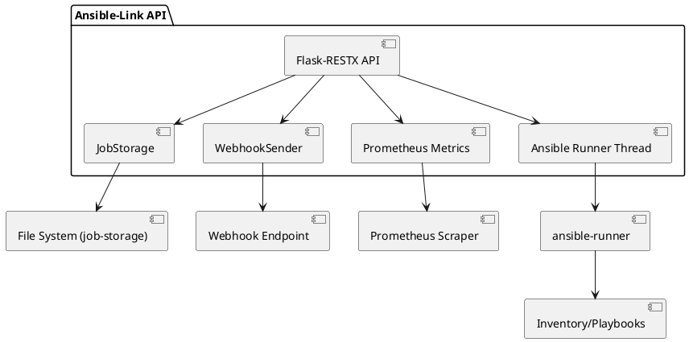
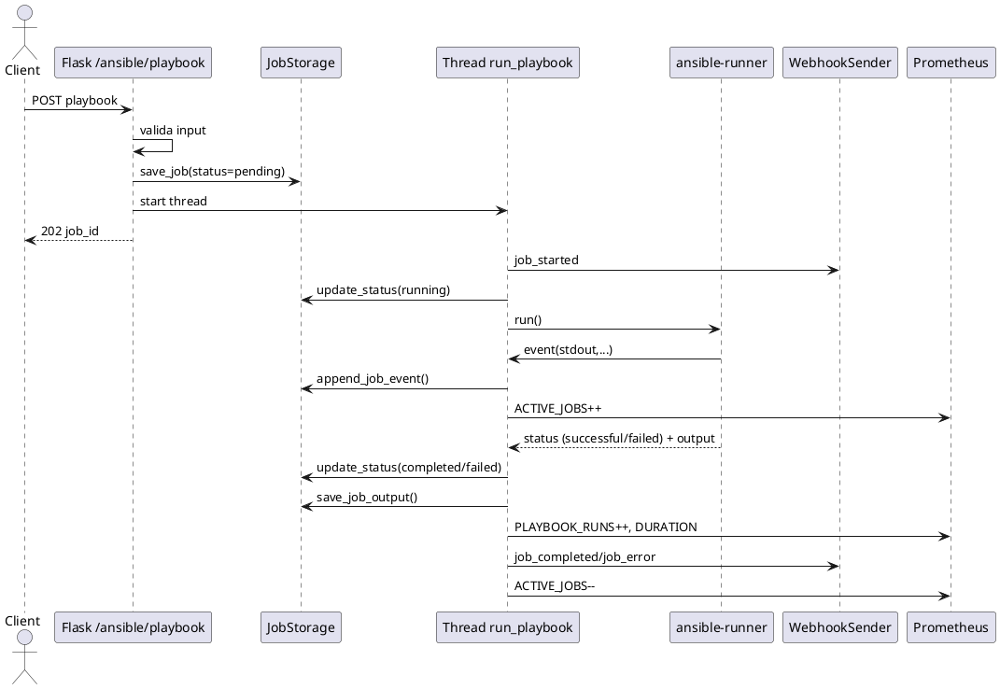

# Panoramica di Ansible-Link

Questo documento riassume le funzionalità presenti, il flusso di esecuzione dei job e l'architettura attuale del progetto Ansible-Link.

## Funzionalità principali
- **Avvio playbook Ansible via REST**: endpoint `POST /ansible/playbook` che valida la richiesta, genera un `job_id` e avvia l'esecuzione in un thread separato tramite `ansible-runner` restituendo 202. 【F:src/ansible_link.py†L230-L274】【F:src/ansible_link.py†L153-L229】
- **Persistenza dei job**: salvataggio in file JSON (`job-storage`) con metadati, stato e output; interrogazione tramite `GET /ansible/job/<job_id>` e `GET /ansible/jobs`. 【F:src/ansible_link.py†L278-L305】【F:src/job_storage.py†L12-L62】
- **Consultazione output/progresso**: endpoint `GET /ansible/job/<job_id>/output` per ottenere stdout/stderr aggregati, eventi e risultato finale, `GET /ansible/job/<job_id>/progress` per avere solo lo snapshot di avanzamento con i soli eventi di progresso, e `GET /ansible/job/<job_id>/result` per recuperare il JSON finale da `set_stats`. 【F:src/ansible_link.py†L306-L346】【F:src/job_storage.py†L12-L74】
- **Webhook opzionali**: notifiche per eventi `job_started`, `job_completed` e `job_error` con formattazione specifica per Slack/Discord o payload generico. 【F:src/ansible_link.py†L157-L225】【F:src/webhook.py†L13-L71】
- **Metriche Prometheus**: contatori per run totali, istogramma per durata e gauge per job attivi, esposti da un server interno. 【F:src/ansible_link.py†L154-L229】【F:src/ansible_link.py†L336-L353】
- **Discovery playbook**: elenco dei playbook disponibili in base alla whitelist configurata. 【F:src/ansible_link.py†L293-L305】

## Concorrenza e comportamento asincrono
- Ogni richiesta di esecuzione avvia un *nuovo thread* che esegue `ansible-runner`, permettendo a più client di lanciare job in parallelo. Non esiste un meccanismo di coda: i job partono subito e condividono le risorse del processo. 【F:src/ansible_link.py†L259-L274】【F:src/ansible_link.py†L153-L193】
- Il client riceve subito il `job_id` e può disconnettersi; lo stato e l'output vengono scritti su disco e sono recuperabili con `GET /ansible/job/<job_id>` anche dopo che il job è terminato. 【F:src/ansible_link.py†L243-L291】【F:src/job_storage.py†L20-L62】

## Stati del job
- **Persistiti**: `pending` (al salvataggio iniziale), `running` (impostato all'avvio del runner), `completed` oppure `failed` (in base a `runner.status`), `error` (eccezioni). 【F:src/ansible_link.py†L193-L238】【F:src/ansible_link.py†L243-L273】
- **Avanzamento**: i callback `event_handler` di `ansible-runner` catturano le linee di stdout con metadati (evento, contatore, UUID, timestamp) e le persistono in `events` per il job. Il campo `progress` mantiene fase (`pending|start|step|done|error`), `completed_steps`, `expected_total_steps`, `completed_weight`, `expected_weight_total` e l'ultima `label` ricevuta. 【F:src/ansible_link.py†L199-L249】【F:src/job_storage.py†L18-L74】
- **Output live**: l'endpoint `GET /ansible/job/<job_id>/output` restituisce stato, stdout aggregato dalle `events`, stderr, il campo `progress` aggiornato, l'eventuale `result` JSON finale (derivato da `set_stats`) e gli eventi stessi per consultare il progresso in tempo reale; in alternativa `GET /ansible/job/<job_id>/progress` e `GET /ansible/job/<job_id>/result` permettono di recuperare solo l'avanzamento o solo il risultato finale. 【F:src/ansible_link.py†L306-L346】【F:src/job_storage.py†L18-L74】

### Come vengono catturati gli eventi
- `ansible-runner` emette per ogni passo un payload `event_data` che include, tra gli altri, `event`, `counter`, `stdout`, `uuid` e `created`.
- Il `event_handler` registrato in `run_playbook` intercetta ogni evento: quando è presente `stdout`, crea un dizionario con i metadati (`timestamp`, `event`, `counter`, `stdout`, `uuid`) e lo aggiunge a `job.events` tramite `JobStorage.append_job_event`. 【F:src/ansible_link.py†L193-L238】【F:src/job_storage.py†L18-L35】
- Le linee che matchano il formato `[AL_PROGRESS <phase>] key=value ...` vengono ulteriormente parsate per aggiornare `job.progress` con fase (`start|step|done|error`), conteggio step, pesi e label. Questo consente di separare gli eventi di avanzamento dal resto dello stdout e alimentare una progress-bar. 【F:src/ansible_link.py†L199-L249】【F:src/job_storage.py†L18-L74】
- Gli output finali strutturati sono raccolti dagli eventi `set_stats` di Ansible e salvati in `job.result`, evitando di veicolarli via stdout. 【F:src/ansible_link.py†L213-L248】【F:src/job_storage.py†L18-L74】

Esempio di progress standardizzato in un playbook con 4 step:

```yaml
- name: inizio esecuzione
  ansible.builtin.debug:
    msg: "[AL_PROGRESS start] expected_total=4 expected_weight=4 label=\"Deploy applicazione\""

- name: step 1
  ansible.builtin.shell: ./task1.sh
- name: step 1 completato
  ansible.builtin.debug:
    msg: "[AL_PROGRESS step] weight=1 label=\"Task 1 completato\""

# ... ripetere per step successivi ...

- name: completato
  ansible.builtin.debug:
    msg: "[AL_PROGRESS done] label=\"Deploy terminato\""

- name: pubblica risultato finale strutturato
  ansible.builtin.set_stats:
    data:
      endpoint: "https://app.example.com"
      version: "1.2.3"
```

## Scheduling e gestione della concorrenza
- **Nessuna coda**: i job sono eseguiti immediatamente nel thread creato; la concorrenza è delegata al modello multithread di Flask + il thread manuale per runner.
- **Limiti**: assenza di throttling o pool di worker; un numero elevato di richieste può saturare le risorse.

## Architettura (PlantUML)
### Componenti principali


### Sequenza esecuzione job


## Considerazioni su funzionalità mancanti o migliorabili
- **Endpoint per output live**: oltre a `GET /ansible/job/<job_id>/output`, sono disponibili endpoint dedicati per progresso (`/progress`) e risultato (`/result`); ulteriori estensioni potrebbero includere streaming SSE/WebSocket. 【F:src/ansible_link.py†L306-L346】
- **Coda/pool di esecuzione**: non esistono limiti di concorrenza o meccanismi di scheduling; introdurre un worker pool o una coda permetterebbe di controllare il carico. 【F:src/ansible_link.py†L259-L274】
- **Persistenza thread-safe/DB**: la gestione file-based può diventare un collo di bottiglia o creare race condition con molti job; l'uso di lock o di un backend DB migliorerebbe l'affidabilità. 【F:src/job_storage.py†L12-L62】
